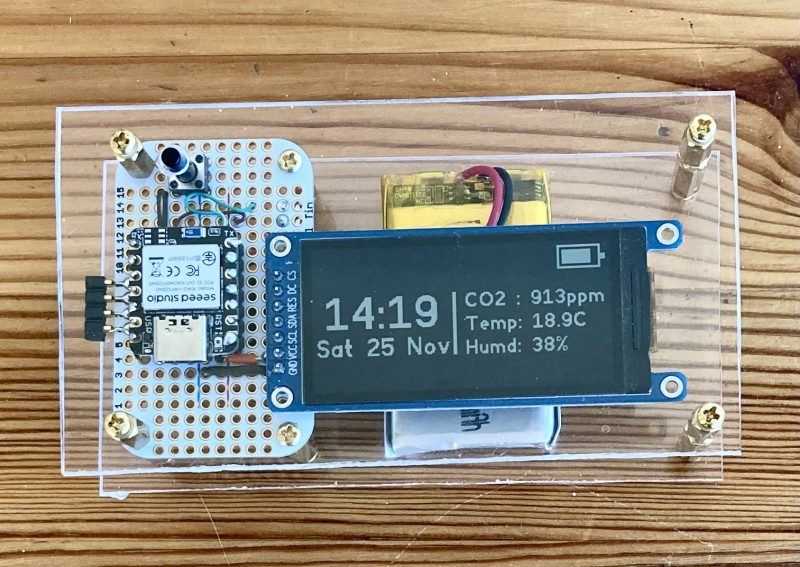
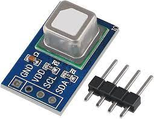
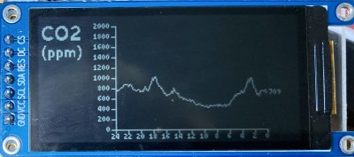

## CO2 Monitor using SCD41 sensor

Continuous monitor and display of CO2 levels using a SCD41 sensor (see below):

The sensor is mounted below the circuit board in the picture of the prototype (top). The CO2 sensor also measures temperature and humidity.

Measurements are taken every 5 minutes and recorded every 10 minutes. The 800mah Lipo should last about two weeks between charges.

 Recorded measurements are displayed (see below) and can be retrieved using bluetooth. In addition, the current reading of CO2, temperature and hmidity is included in the manufacturers data in the BLE advertising messages.

 

