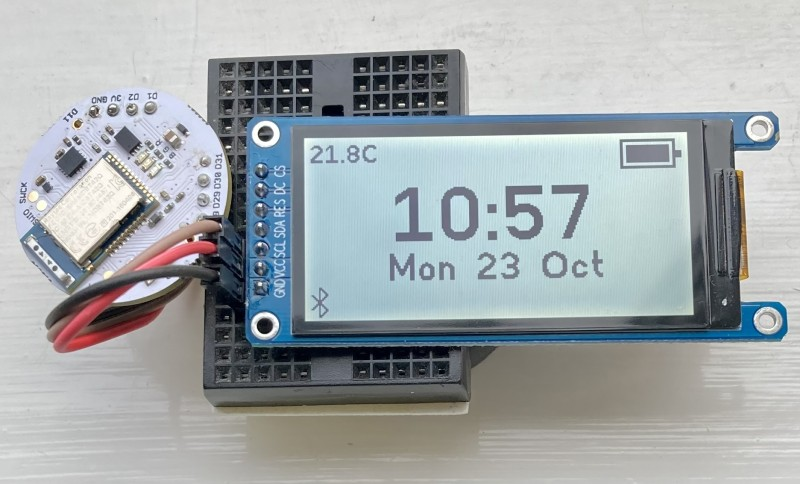

# Low Power Display- ST7302

The 2.13" (250 x 122 pixel ) reflective display shown below connected to a Puck.js  V2.1  has an ST7302 hardware driver. The display is similar to a Sharp Memory Display in that has no backlight and it  permits much faster updates than Epaper displays.

In low power mode with frame refresh set to 4Hz, it uses on average 30 microamps. This is a versatile  display, in that,  in high power mode it can update  at a 32Hz frame rate  with current consumption  still less than 1 milliamp.





The ST7302 permits  display pixels to be updated in 24 pixels chunks, however, in the `ST7302.js` driver included here, updates are full screen only since this takes only 10ms and partial updates might in fact be slower due to the quite complex mapping from Espruino pixels to display pixels. Consequently, the driver uses a 4125 byte buffer with pixels stored in ST7302 order.

To use the driver (after it has been copied to a file named  `ST7302` in `Storage`) :

```
SPI1.setup({sck:D2, mosi:D28, baud: 10000000}); 

var g = require("ST7302").connect({
  spi:SPI1,
  dc:D30,
  ce:D31,
  rst:D29
});
```

The example code for the display pictured is in `example.js`
