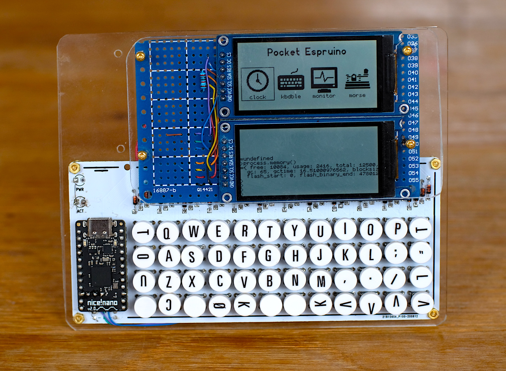

### Pockettype keyboard 

A prototype device with two ST7302 low power displays and a Pockettype keyboard. The keyboard includes an Nice!Nano NRF52840 board which runs Espruino.

Both the keyboard matrix scanner and the display drivers are implemented in Espruino. The keyboard can be made to appear as a bluetooth keyboard to a host computer using a version of the Espruino BLE HID keyboard module.

The picture shows a clock application running in the upper display with console output appearing on Terminal on the lower display.

 